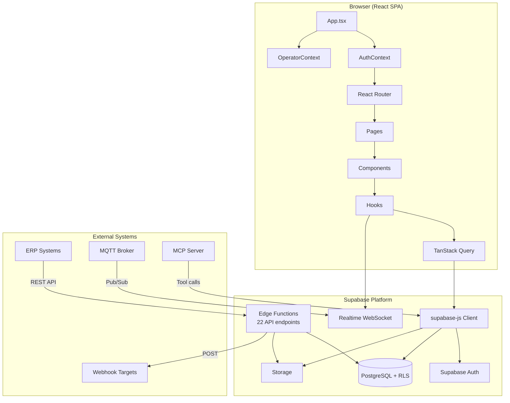
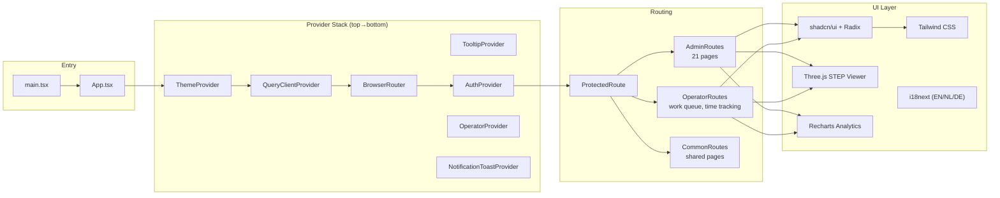
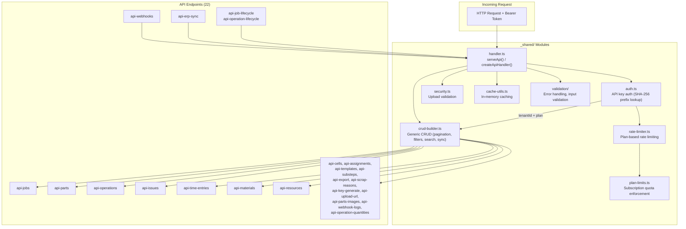
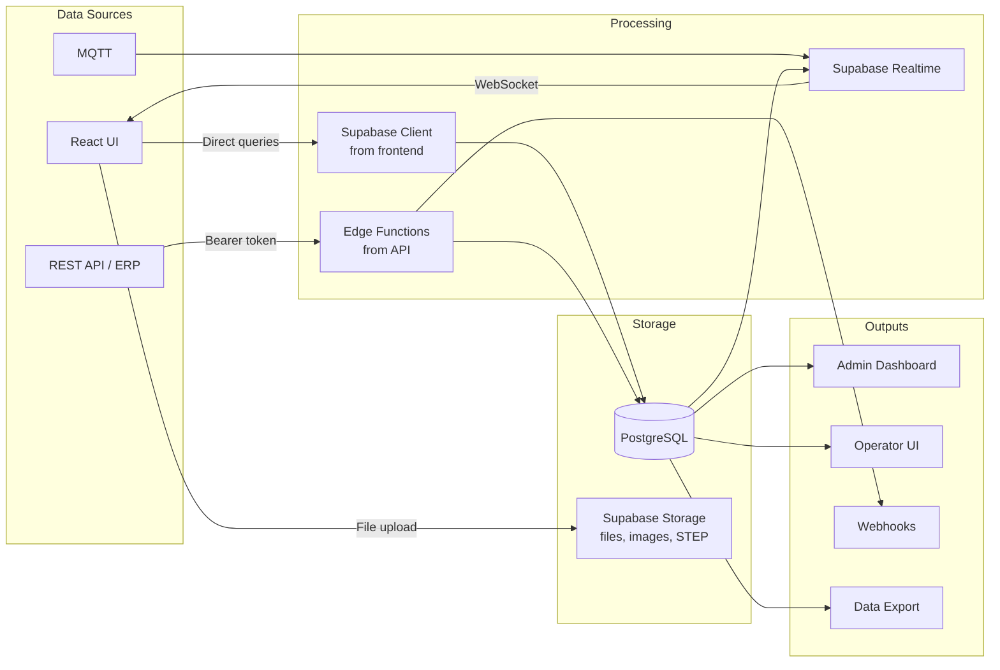
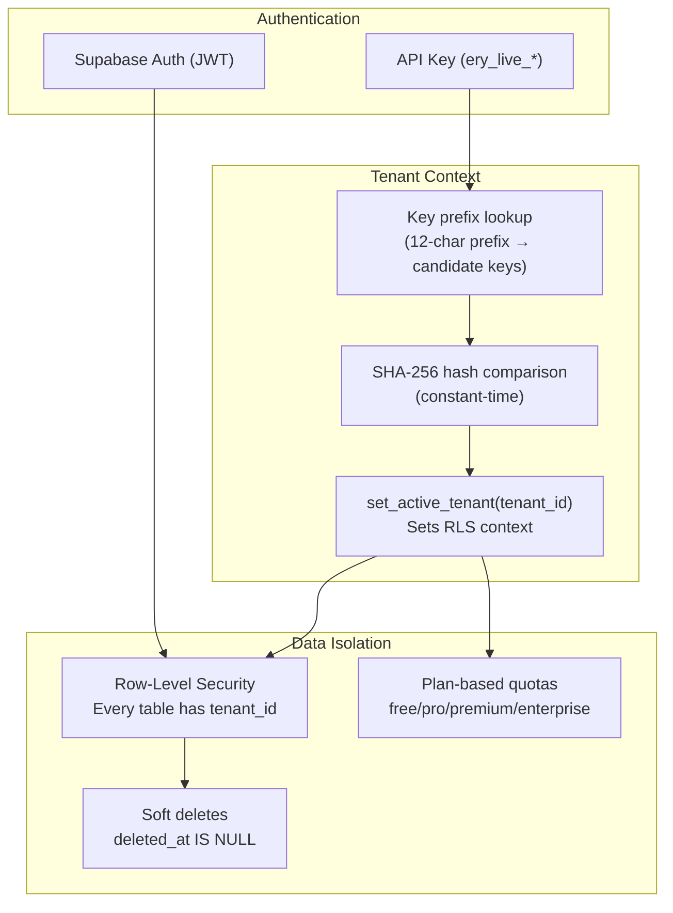
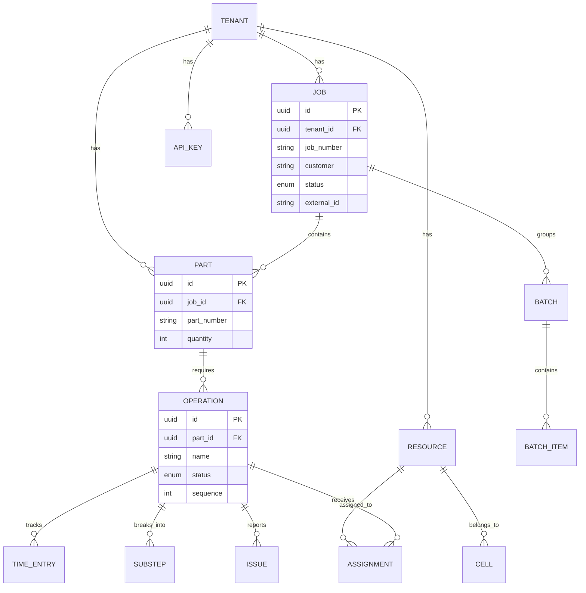

# Architecture — Eryxon Flow

> Machine-readable architecture map for AI agents and human developers.

## System Overview



## Frontend Architecture



## Backend Architecture (Edge Functions)



## Data Flow



## Multi-Tenant Isolation



## Domain Model



## Directory Map

```
eryxon-flow/
├── src/
│   ├── components/          # 168 files — UI components
│   │   ├── ui/              # shadcn/ui base (buttons, dialogs, tables)
│   │   ├── admin/           # Admin-specific (MCP, analytics, settings)
│   │   ├── operator/        # Tablet UI (work queue, time tracking)
│   │   ├── viewer/          # 3D STEP viewer (Three.js)
│   │   ├── scheduler/       # Job scheduling (drag-drop)
│   │   ├── issues/          # NCR/issue management
│   │   └── ...              # auth, capacity, onboarding, parts, qrm, terminal
│   ├── hooks/               # 42 files — Data fetching & state
│   │   ├── useRealtimeSubscription  # WebSocket subscriptions
│   │   ├── useOEEMetrics            # OEE calculations
│   │   ├── useServerPagination      # API pagination
│   │   └── ...
│   ├── pages/               # 55 files — Route targets
│   │   ├── admin/           # Dashboard, Jobs, Parts, Operations, Analytics...
│   │   └── operator/        # Work queue, time tracking
│   ├── routes/              # Route definitions + guards
│   ├── contexts/            # AuthContext, OperatorContext
│   ├── lib/                 # Utilities (queryClient, logger, scheduler, search)
│   ├── integrations/        # Supabase client + generated types
│   ├── i18n/                # Translations (EN, NL, DE)
│   ├── config/              # App config, CAD backend, status enums
│   ├── types/               # Shared TypeScript types
│   └── theme/               # Dark/light theme
├── supabase/
│   ├── functions/
│   │   ├── _shared/         # handler, crud-builder, auth, plan-limits, security
│   │   └── api-*/           # 22 REST API endpoints (Deno)
│   └── migrations/          # PostgreSQL schema (timestamped SQL)
├── mcp-server/              # MCP server for AI tool integration
├── website/                 # Astro documentation site
├── scripts/                 # Build & deployment utilities
├── docs/                    # DBML schema, guides, operations
└── .agents/                 # Universal AI agent instructions
```

## Key Patterns

| Pattern | Where | How |
|---------|-------|-----|
| CRUD Builder | `_shared/crud-builder.ts` | Config-driven CRUD: pass table name + options, get pagination/filters/search/sync |
| API Handler Factory | `_shared/handler.ts` | `serveApi(handler)` wraps CORS, auth, error handling around any endpoint |
| Prefix Auth | `_shared/auth.ts` | API keys use 12-char prefix lookup + SHA-256 hash for O(1) auth |
| Plan Limits | `_shared/plan-limits.ts` | Quota checks per tenant plan (free/pro/premium/enterprise) |
| Soft Deletes | All tables | `deleted_at` + `deleted_by` columns, filtered by default in queries |
| ERP Sync | `api-erp-sync/`, crud-builder | `external_id` + `external_source` + `sync_hash` for idempotent sync |
| Realtime | `useRealtimeSubscription` | Supabase Realtime channels for live UI updates |
| i18n | `src/i18n/` | All UI text via `t()` keys — EN, NL, DE |
| Chunk Splitting | `vite.config.ts` | Manual chunks: react, supabase, query, charts, three, ui |
