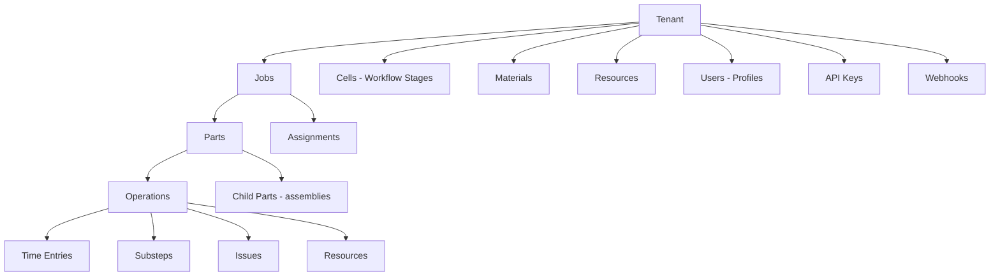

MES for custom metals fabrication—sheet metal, structural steel, precision machining. Tracks work through three levels: **Jobs** (customer orders) → **Parts** (components) → **Operations** (tasks like cutting, bending, welding, machining).

---

## System Overview

### Technology Stack

- **Frontend:** React 18 + TypeScript + Material UI v7
- **Backend:** Supabase (PostgreSQL database, Edge Functions)
- **Authentication:** Supabase Auth with JWT tokens
- **3D Viewer:** Three.js + occt-import-js for STEP files
- **API:** RESTful Edge Functions with API key authentication
- **Real-time:** Supabase Realtime for live updates

### Architecture Pattern

- **Multi-tenant:** Complete tenant isolation at database and application level
- **Role-based access:** Admin and Operator roles with different permissions
- **Progressive Web App:** Mobile-responsive, can be installed as PWA

### Data Model Hierarchy

---

## Technical Architecture

### Frontend Architecture

**Framework:** React 18 with TypeScript

**State Management:**
- React Context (`AuthContext`) - Global auth state
- React Query (TanStack Query) - Server state caching
- React Hook Form - Form state
- Local state (useState) - Component UI state

**Routing:** React Router v6
- Protected routes with auth check
- Role-based route access
- Automatic redirects

**UI Libraries:**
- Material UI v7 - Complex components (DataGrid, date pickers)
- shadcn/ui - Base UI primitives (Button, Card, Dialog)
- Tailwind CSS - Utility styling

**3D Rendering:**
- Three.js - WebGL 3D graphics
- occt-import-js - STEP file parser

### Backend Architecture

**Platform:** Supabase

**Database:** PostgreSQL with Row-Level Security (RLS)
- Multi-tenant isolation via RLS policies
- Automatic filtering by tenant_id
- Role-based permissions

**Edge Functions:** Deno-based serverless functions
- RESTful API endpoints
- API key authentication
- Request validation
- Response formatting
- Webhook dispatch

**Authentication:** Supabase Auth
- JWT-based sessions
- Email/password auth
- Auto-refresh tokens
- Session persistence

**Storage:** Supabase Storage
- File uploads (STEP, images, PDFs)
- Signed URLs with expiration
- RLS policies for tenant isolation

**Real-time:** Supabase Realtime
- PostgreSQL change data capture (CDC)
- WebSocket-based subscriptions
- Live updates across clients

---

## User Roles

| Role | Access | Primary Interface |
|------|--------|-------------------|
| **Admin** | Full system: jobs, config, users, API keys, webhooks | Desktop (`/dashboard`) |
| **Operator** | View/execute work, time tracking, report issues | Tablet (`/work-queue`) |
| **Machine** | API-only, for ERP integrations | None (API only) |

---

## Security

- **Auth:** JWT tokens with auto-refresh
- **Authorization:** Role-based (Admin/Operator), route protection
- **Data isolation:** Row-Level Security (RLS), tenant-scoped queries
- **API:** Key hashing (bcrypt), HMAC signatures for webhooks, rate limiting
- **Storage:** Private buckets, signed URLs with expiration

## Integrations

**API:** Bearer token authentication (`Authorization: Bearer ery_live_xxx`)

**Webhooks:** Register URL → select events → receive HTTP POST → verify HMAC signature

See [API Documentation](/api/api_documentation/) for full reference.
