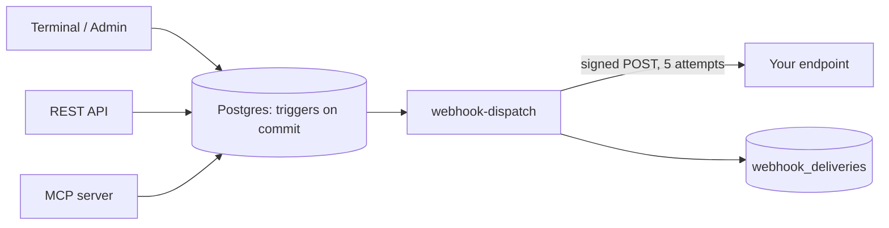

Eryxon Flow pushes production events to your systems as signed HTTP POST requests.
Events are emitted by database triggers, so the terminal, the REST API, the MCP
server and an admin edit all produce exactly the same webhooks. Nothing fires for a
change that did not commit.



Need a message broker? Subscribe a small bridge to the webhook and publish from
there. The app does not speak MQTT or AMQP itself.

## Configuration

Admin → Integrations → Webhooks. An endpoint has a name, a public `https://` URL,
the events it subscribes to, and a signing secret that is shown once at creation.
The same fields are available through `POST /api-webhooks` and the MCP tool
`create_webhook`.

An endpoint is disabled automatically after 25 consecutive failed deliveries.
Switching it back on resets the counter.

## Event catalogue

| Entity | Events |
|---|---|
| `job` | `created`, `updated`, `started`, `paused`, `resumed`, `completed`, `deleted` |
| `part` | `created`, `updated`, `started`, `paused`, `resumed`, `completed`, `deleted` |
| `operation` | `created`, `updated`, `started`, `paused`, `resumed`, `completed`, `deleted` |
| `batch` | `created`, `updated`, `started`, `completed`, `deleted` |
| `issue` | `created`, `updated`, `resolved`, `deleted` |
| `production` | `reported` (an output, scrap or rework quantity), `deleted` |
| `sync` | `jobs.completed`, `parts.completed`, `resources.completed`, `batch.completed` (ERP sync summaries) |
| `webhook` | `test` (sent from the admin page) |

`started`, `paused`, `resumed` and `completed` follow the record's `status`
transition; any other change is `updated`. An issue is `resolved` when its status
becomes `approved`, `rejected` or `closed`.

## Payload

```json
{
  "id": "2f1c…",
  "event": "operation.completed",
  "occurred_at": "2026-09-18T10:30:00.123Z",
  "tenant_id": "…",
  "data": {
    "record": { "id": "…", "operation_name": "Laser cutting", "status": "completed", "actual_time": 50, "…": "every column of the row" },
    "previous_status": "in_progress",
    "context": { "job_id": "…", "job_number": "J-2026-001", "customer": "…", "part_id": "…", "part_number": "P-001", "cell_id": "…", "cell": "Laser" },
    "actor_id": "uuid of the signed-in user, or null for API and MCP keys"
  }
}
```

`record` is the full row after the change (`previous_status` carries the status
before it). `context` names the job, part and cell the record belongs to so you
do not have to look them up. Sync events carry a summary object instead of a
record.

## Headers and signature

| Header | Value |
|---|---|
| `X-Eryxon-Event` | the event name |
| `X-Eryxon-Event-Id` | the event id; identical on redelivery, use it to deduplicate |
| `X-Eryxon-Delivery-Id` | unique per attempt series |
| `X-Eryxon-Signature` | `t=<unix seconds>,v1=<hex HMAC-SHA256>` |
| `User-Agent` | `Eryxon-Webhooks/2` |

The signature is HMAC-SHA256 with the endpoint secret over `<t>.<raw body>`.
Verify against the raw request body, then reject timestamps older than a few
minutes to block replays.

```javascript
// Node.js
import { createHmac, timingSafeEqual } from 'node:crypto';

export function verify(rawBody, signatureHeader, secret, toleranceSeconds = 300) {
  const { t, v1 } = Object.fromEntries(signatureHeader.split(',').map((p) => p.split('=')));
  if (Math.abs(Date.now() / 1000 - Number(t)) > toleranceSeconds) return false;
  const expected = createHmac('sha256', secret).update(`${t}.${rawBody}`).digest('hex');
  return v1.length === expected.length && timingSafeEqual(Buffer.from(v1), Buffer.from(expected));
}
```

```python
# Python
import hmac, hashlib, time

def verify(raw_body: bytes, signature_header: str, secret: str, tolerance=300) -> bool:
    parts = dict(p.split("=", 1) for p in signature_header.split(","))
    if abs(time.time() - int(parts["t"])) > tolerance:
        return False
    expected = hmac.new(secret.encode(), f"{parts['t']}.".encode() + raw_body, hashlib.sha256).hexdigest()
    return hmac.compare_digest(parts["v1"], expected)
```

## Delivery and retries

| Setting | Value |
|---|---|
| Timeout per attempt | 10 s |
| Attempts | 5 |
| Backoff | 0.5 s, 1 s, 2 s, 4 s, then 5 s |
| Retried on | connection errors, `408`, `429`, `5xx` |
| Not retried on | any other `4xx` |
| Auto-disable | after 25 consecutive failed deliveries |

Respond `2xx` quickly and do the work afterwards. Every delivery is recorded with
status, HTTP code, attempts, latency and an excerpt of the response; the admin page
lists the last 200 and can send any of them again. The REST API exposes the same
records at `GET /api-webhook-deliveries`.

## Security

- Targets must be public `https://` URLs. Private ranges (`10.*`, `192.168.*`,
  `172.16-31.*`, `127.*`, `localhost`, `*.local`, link-local) are refused on the
  hosted service. A self-hosted installation can allow them with
  `WEBHOOK_ALLOW_PRIVATE_TARGETS=true` on the Edge Functions.
- The secret is stored with the endpoint and never returned by the API or shown
  again in the UI. Rotate by creating a new endpoint and deleting the old one.
- Only workshop admins can manage endpoints or read deliveries; the dispatcher
  writes them with the service role.
