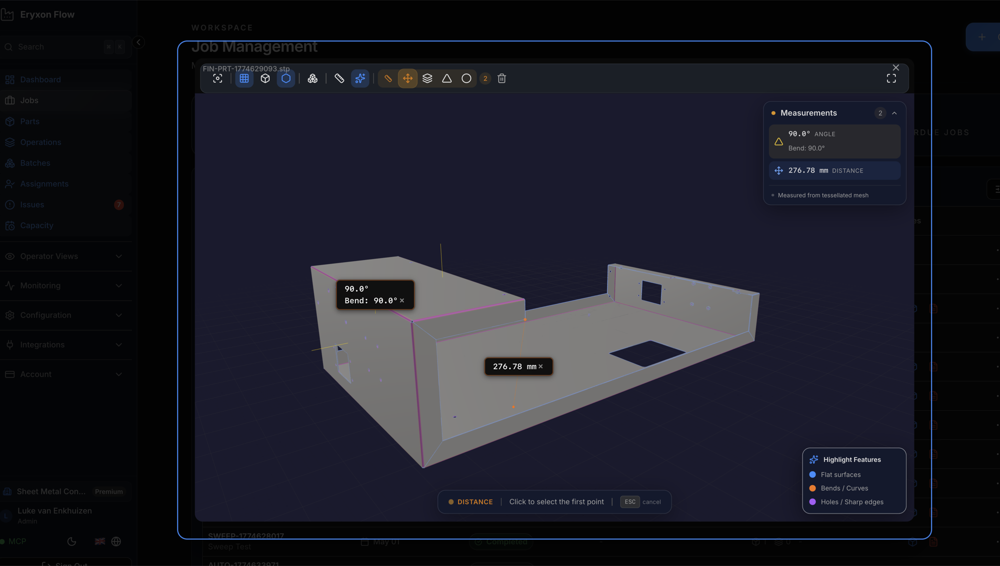
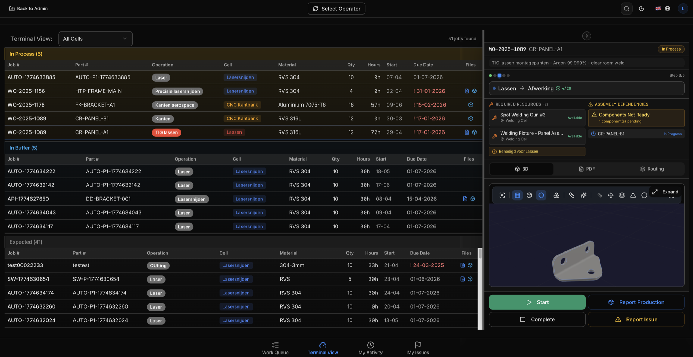

## What it does

The 3D STEP viewer lets you view CAD models directly in the browser. Upload a STEP file to a part, click "View 3D", and inspect the model from every angle — no desktop CAD software needed.

## Features

- View `.step` and `.stp` files in the browser
- Orbit, zoom, and pan with mouse or touch
- Exploded view to separate assembly components
- Wireframe mode toggle
- Auto-sized grid that adapts to model dimensions
- Fit-to-view to center and frame the model automatically
- Measurement tools: distance, thickness, angle, and radius
- PMI overlay when PMI data has been extracted
- Upload, view, and delete CAD files per part
- Tenant-isolated file storage

## Supported file formats

| Format | Extensions | Viewer |
|--------|------------|--------|
| STEP | `.step`, `.stp` | 3D interactive viewer with measurements |
| PDF | `.pdf` | Built-in PDF viewer for drawings and documents |

## How to use it

### Upload a CAD file

1. Go to **Admin Dashboard > Parts**
2. Click a part to open the detail modal
3. Scroll to the **3D CAD Files** section
4. Click **Choose STEP files** or drag and drop your files
5. Click **Upload**

### View a 3D model

1. Click the **View 3D** button next to any uploaded file
2. The viewer opens full-screen

### Controls

| Action | Input |
|--------|-------|
| Rotate | Left-click and drag |
| Zoom | Scroll wheel |
| Pan | Right-click and drag |
| Center model | Click **Fit View** |
| Wireframe | Toggle in toolbar |
| Exploded view | Toggle in toolbar, adjust slider |
| Grid | Toggle in toolbar |

### Measurements

Select a measurement tool from the toolbar, then click points or faces on the model. Available tools:

- **Point distance** — click two points to measure the distance between them
- **Face distance** — click two faces
- **Face angle** — click two faces to measure the angle
- **Radius** — click a curved face

### Delete a file

Click the trash icon next to the file and confirm.

## File size recommendations

- **Best performance:** files under 10 MB
- **Maximum upload size:** 100 MB
- **Browser parsing limit:** roughly 50 MB — larger files may slow down or fail to render
- **Large assemblies:** split into sub-assemblies where possible

## Troubleshooting

### Model won't load

Check the browser console for error messages:

- **"Failed to load STEP parser library"** — usually a network issue. The parser is loaded from a CDN at runtime. Check your internet connection and any firewall rules.
- **"No geometry found in STEP file"** — the file may be corrupt or empty. Try re-exporting it from your CAD software.

### Model appears off-center

Click the **Fit View** button in the toolbar.

### Model looks wrong or incomplete

- Verify the file opens correctly in desktop CAD software
- Try re-exporting as STEP AP214
- If the file is very large, try splitting the assembly

## Advanced CAD integration

The built-in viewer handles geometry visualization and measurements for most shop floor use cases. For advanced requirements like PMI (GD&T annotations from the model), server-side tessellation, or CAD format conversion, Eryxon Flow supports an optional CAD backend service.

Partners like [Sheet Metal Connect](https://www.vanenkhuizen.com/) can help set up advanced CAD processing pipelines. [Get in touch](mailto:office@vanenkhuizen.com) to discuss your requirements.
