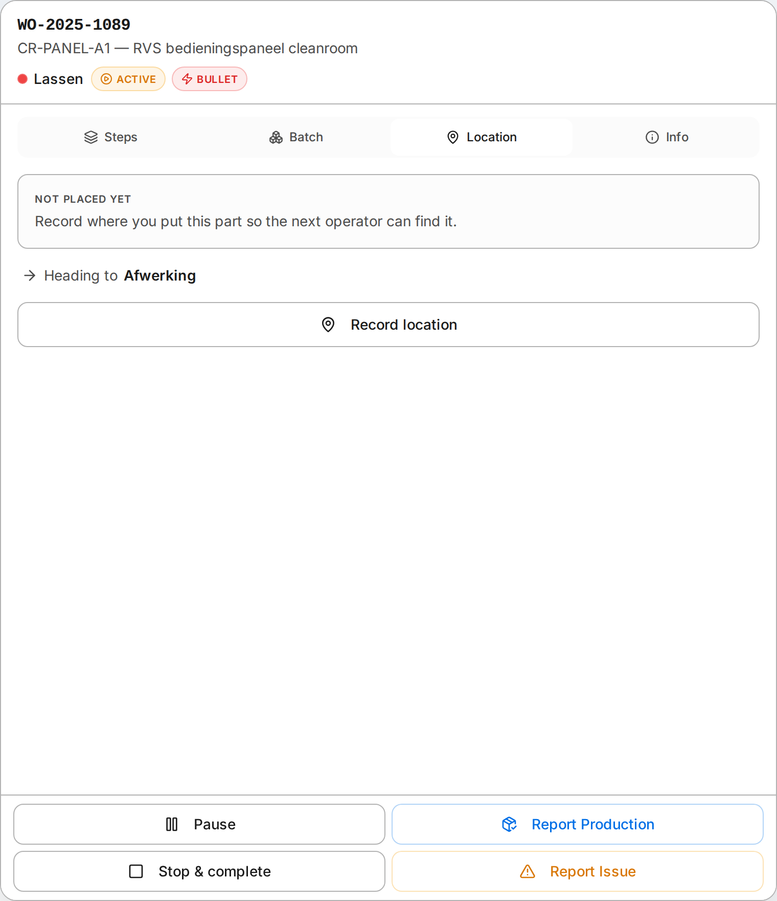

Location tracking answers one question on the floor: "where did you put it?" — once, at the machine, instead of reconstructing it later. It is off by default and turns on per shop.

Recent changes to this area are in the [release notes](/release-notes/).

## When to use it

A part finishes at one cell and waits for the next. On a busy floor, finding that part again costs time. Location tracking records the drop-off slot at the moment the operator reports the work done, so the next person walks straight to it and the planner can see what space is left.

It is on by default. If your floor does not move parts between buffers, turn it off in **Organization Settings → Location tracking** — when off, the terminal does not touch any of it.

## Admin setup

Location tracking is on out of the box, so lay out your physical drop-off slots at **Configuration → Locations** (Organization Settings reminds you with a link while no slots exist). A fresh demo workspace already comes with a few example slots per cell so you can see it work:

- Give each slot a **code** (for example `A01`) and an optional label.
- Tie a slot to a **cell** so the picker shows that cell's slots first; leave the cell blank for a general slot any cell can use.
- Set a **capacity** — how many parts the slot holds.

A slot can be a rack position, a floor zone, a trolley — whatever your floor already uses.

## Operator flow

1. The operator finishes an operation and taps complete.
2. A slot picker opens, scoped to the **cell the part heads to next** (plus any general slots), pre-selecting the most open one and naming that cell so the part lands in the right lane.
3. The operator confirms (or picks a different slot). Full slots are marked so nothing gets double-stacked.

That is the whole interaction — one tap on the slot, one to confirm. A part is only ever in one place: recording a new slot clears the old one automatically.

The same view lives in the operator terminal's **Location** tab, so an operator can check or change where a part is at any time — not only at completion. It shows the current slot (or "not placed yet") and where the part is heading next.

## What you get

- **Occupancy at a glance** — free versus full per slot, computed live from what is currently placed.
- **One place per part** — the system never shows a part in two locations.
- **Attribution** — the placement records who put it there, the same way time entries record who did the work.

## Planned

Capacity by part size, a visual map of the layout, and API access for automated placement are on the roadmap, not yet shipped.
