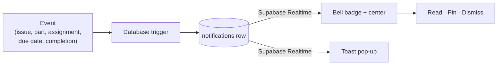

Things happen across a shop all day: an operator reports a problem, a job creeps toward its due date, a new part lands, an operation finishes. Notifications surface those events where people already look — a bell badge in the header and a live toast — so nobody has to go hunting for what changed.

## How it works

An event in the database fires a trigger, which writes a notification row. Supabase Realtime pushes that row to everyone it concerns, updating the bell badge and popping a toast — no refresh needed.

Notifications are stored, not just shown, so the bell center keeps a history you can read, pin, and dismiss — and it stays in sync across tabs and devices.

## What triggers a notification

| Type | When | Who sees it |
|------|------|-------------|
| New issue | An operator reports a quality issue | Admins (severity matches the issue) |
| Job due soon | A job's due date is within 7 days | Admins (high at 1 day, medium at 3, low at 7) |
| New part | A part is added | Admins |
| New assignment | Work is assigned to an operator | The assigned operator |
| Part completed | A part is finished | Admins |
| New user | Someone joins the workspace | Admins |
| System | Maintenance and announcements | Targeted users |

Job-due checks de-duplicate within a 24-hour window, so an approaching deadline doesn't spam the bell.

## Managing notifications

- **Bell badge** — the count of unread items; open it for the full center with **All** and **Pinned** tabs.
- **Read / unread** — mark an item read to clear it from the count.
- **Pin** — keep something that needs follow-up at the top.
- **Dismiss** — remove an item you're done with.
- **Mark all read** — clear the count in one tap.
- Clicking a notification jumps to the related page (the issue, the job, the operator view).

Toasts appear for new events as they happen and fade on their own; pin one straight from the toast to keep it in the center.

## Tenant isolation

Every notification is scoped to its workspace and protected by row-level security. A notification can target one person (an operator's assignment) or the whole workspace (a system announcement), and realtime delivery is filtered per workspace — you only ever see your own.
