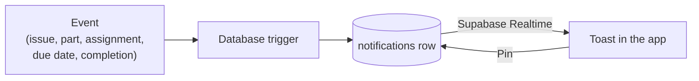

An operator reports a problem, a job creeps toward its due date, a part is finished. Notifications surface those events as a toast in the app, so nobody has to go looking for what changed.

## How it works

An event in the database fires a trigger, which writes a `notifications` row. Supabase Realtime pushes that row to everyone it concerns and the app shows a toast. The row stays stored, so the history is available through the database and the API.

```mermaid
flowchart LR
  E["Event<br/>(issue, part, assignment,<br/>due date, completion)"] --> T["Database trigger"]
  T --> N[("notifications row")]
  N -->|Supabase Realtime| Toast["Toast in the app"]
  Toast -->|Pin| N
```

## What triggers a notification

| Type | When | Who sees it |
|------|------|-------------|
| New issue | An operator reports a quality issue | Admins (severity matches the issue) |
| Job due soon | A job's due date is within 7 days | Admins (high at 1 day, medium at 3, low at 7) |
| New part | A part is added | Admins |
| New assignment | Work is assigned to an operator | The assigned operator |
| Part completed | A part is finished | Admins |
| New user | Someone joins the workspace | Admins |

Job-due checks de-duplicate within a 24-hour window, so an approaching deadline does not repeat every minute.

## Tenant isolation

Every notification is scoped to its workspace and protected by row-level security. A notification targets one person (an operator's assignment) or the whole workspace, and realtime delivery is filtered per workspace.
