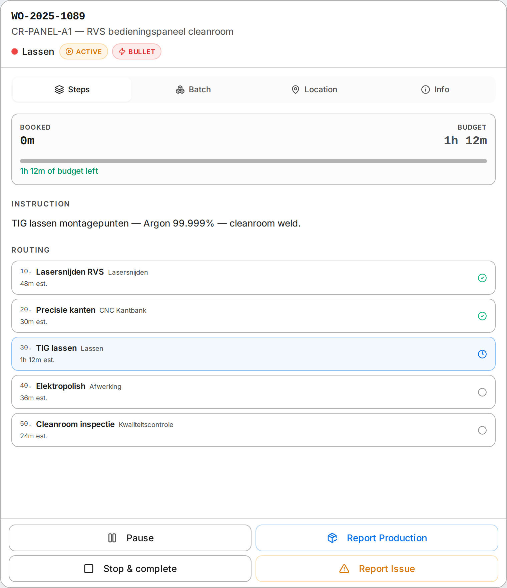
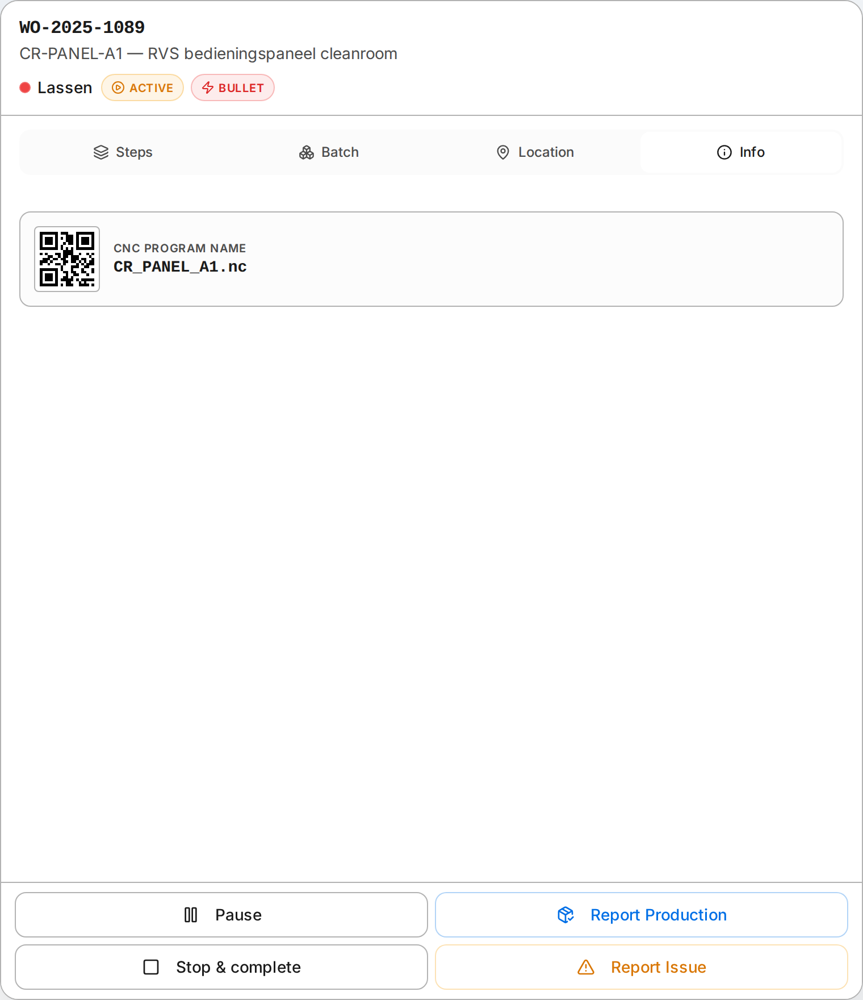
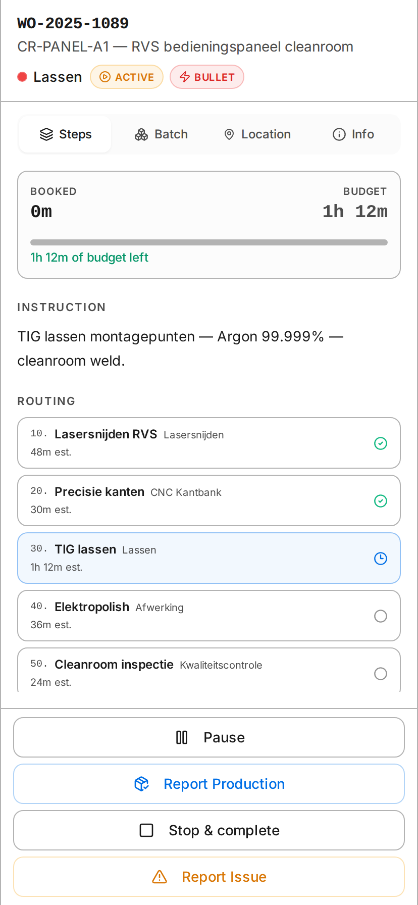
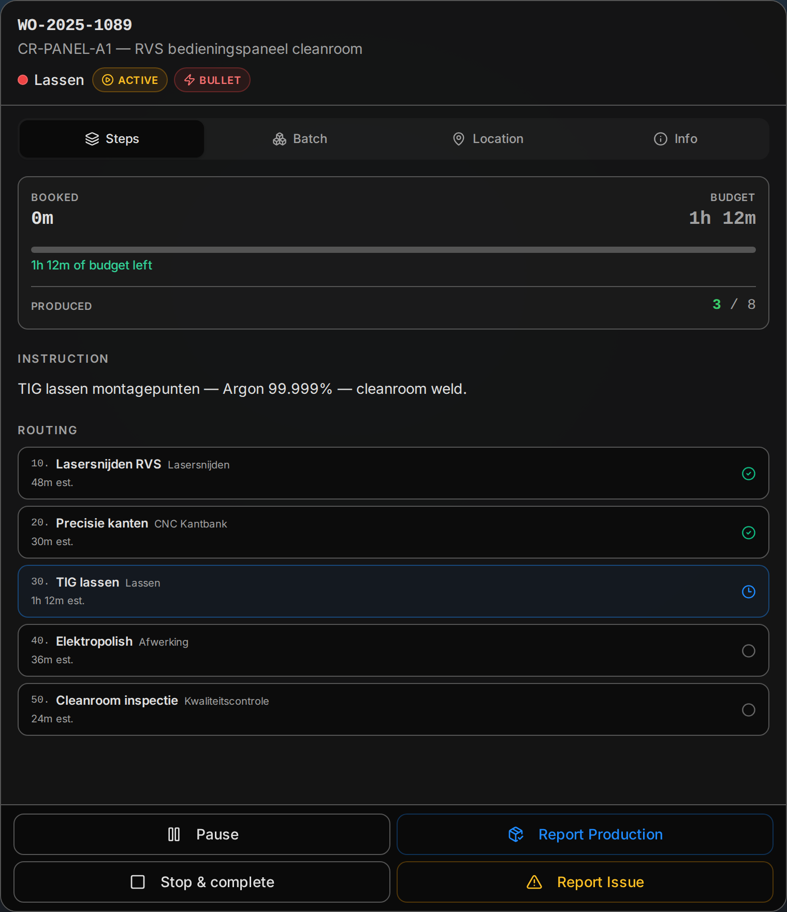

The Operator Terminal is the screen operators see at their workstation. It runs on tablets and large touchscreens on the shop floor. Everything is designed for touch — large tap targets, no tiny buttons, no keyboard needed.

The tabbed detail panel below arrived in the [v0.8.0 release](/release-notes/v0-8-0/); [v0.9.0](/release-notes/v0-9-0/) added time booked-vs-budget, the operators who worked the job, and a one-tap Complete, and made every time read in plain units. All shipped changes live in the [release notes](/release-notes/).

## Selecting Your Cell

When you open the terminal, pick your cell (workstation) from the cell selector at the top. This filters everything to show only work assigned to your cell. If you work at multiple cells, switch between them with one tap.

## The Three Queues

Your work is split into three sections, top to bottom:

### In Process

What you are working on right now. These operations are active — the timer is running. This section is usually one or two items. If something is here, that is your focus.

### In Buffer

What is next. These parts have physically arrived at your cell and are ready to pick up. When you finish your current work, grab the next item from the buffer.

### Expected

What is on its way. These operations are planned for your cell but the parts have not arrived yet. Use this to see what is coming later today or tomorrow.

Each section shows **totals** at the bottom: total time and total pieces. Time reads in plain units — `45m`, `1h 20m`, `2h` — never minutes mislabelled as hours.

## POLCA Cell Signal

Every operation in your queue shows a cell signal like **Laser → Zetten: GO** or **Zetten → Lassen: PAUSE**.

This tells you two things:
- **Your cell → Next cell** — where the part goes after you finish
- **GO or PAUSE** — whether the next cell has capacity to accept work

If the signal says **GO**, the next cell is ready. Work on it. If it says **PAUSE**, the next cell is full. Work on other items with a GO signal first. This keeps parts flowing instead of piling up between stations.

## Backlog Status

The backlog column tells you how urgent each operation is:

| Status | Meaning |
|---|---|
| **Te laat** | Overdue. Should have been done already. |
| **Vandaag** | Due today. Finish before end of shift. |
| **Binnenkort** | Due soon. Coming up in the next few days. |

Combined with the POLCA signal, this helps you decide what to pick up next: overdue GO items first, then today's GO items, then the rest.

## Bullet Cards

A [Bullet Card](/features/qrm-cards/) is the one priority signal in Eryxon Flow. Operations carrying one stand out with a red border and always sort to the top of each section. If you see red, that job jumps the queue — work it even if the next cell shows PAUSE.

## Status Bar

The bar at the bottom of the screen shows your current state:

- **Your name** — confirms who is logged in
- **Current operation** — what you are working on
- **Live timer** — how long you have been on this operation
- **Operator state** — Active or Idle

The state updates automatically. When you start an operation, it switches to Active. When nothing is in process, it shows Idle.

## Detail Panel

Tap any operation to open the detail panel. It is built around one idea: a calm header that tells you *what* you are holding, then everything else tucked behind tabs so the screen never feels cluttered. The panel fills the right side on a workstation and the whole screen on a phone.

At the top, the **header** shows the job number, the part, the cell you are at, and two chips: whether the operation is **active**, and a **Bullet** chip if it carries a [Bullet Card](/features/qrm-cards/) and jumps the queue. Each fact appears once; nothing is repeated.

Below the header, tabs hold the detail (only the ones with something to show appear):

- **Steps** — opens with **time booked vs budget** for this operation (an over/under chip and a progress bar) and the **operators who worked on it**, with a live dot for anyone running the clock now. Below that, the **instruction** for this cell under a clear label, a **step-by-step checklist** that appears while you are clocked on, and the full production route with completed and remaining steps highlighted. Your current step is called out. Times read in plain units (`1h 12m`, not `72h`).
- **Batch** — when the part runs as part of a nest or batch, this shows the batch number, type, status, and how many operations move together. Hidden when the part is not batched. See [Batch & nesting](/features/batch-management/).
- **Location** — where the part physically is and where it is heading next. Shown only when location tracking is on. See [Location tracking](/features/location-tracking/).
- **Info** — required tools and resources, assembly dependencies, and the CNC program QR code.

When the part has a 3D model or a drawing, **3D** and **PDF** tabs appear too — they load only when you open them, so the panel stays fast. Tap **Expand** for a full-screen view.

The **action bar** is pinned to the bottom in thumb reach: **Start / Pause**, **Report production**, **Complete**, and **Report issue**. You don't have to stop the clock before finishing — while you are clocked on, **Complete** reads **Stop & complete** and does both in one tap.

### On a phone

The same panel reflows to a single column on a phone — full-width tabs, stacked actions, large tap targets — so the floor view is just as usable on a handheld as on a wall-mounted terminal.

Close the panel by tapping outside it, pressing the X, or — on a phone — using Back.

### Light and dark

The terminal follows the device theme, so a workstation in a bright hall and a tablet in a dim cell are both easy to read.

## Tips for Daily Use

- Start your shift by checking the **In Buffer** section. That is your immediate work.
- Watch the POLCA signals. Working on GO items keeps the whole shop moving.
- If everything shows PAUSE, flag your foreman — it usually means a downstream bottleneck.
- Use the detail panel to double-check dimensions or instructions before starting a cut.
- Bullet Cards (red border) always come first, regardless of other signals.
