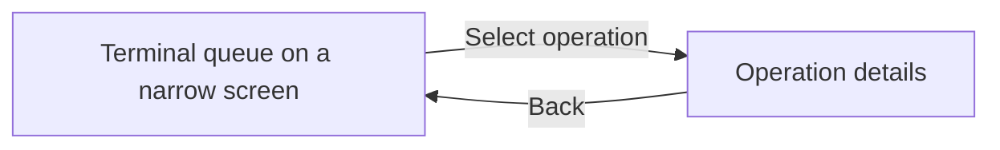

Use the same operator interface on a phone, tablet, or desktop. The **Work Queue**
shows operations across cells; the **Terminal** focuses on the cell selected for
your workstation. Both provide operation details and time tracking.

## Navigation and screen layout

Use the operator navigation to open these views:

| View | Address | Purpose |
| --- | --- | --- |
| Work Queue | `/operator/work-queue` | Find operations across cells; use the scan button to open scanner input. |
| Terminal View | `/operator/view` | Work from the queues for a selected cell. |
| My Activity | `/operator/my-activity` | Review your recorded work. |
| My Issues | `/operator/my-issues` | Review the issues you reported. |

Shared operation links open `/operator/operations/<operation-id>`. Previously saved
`/m` links redirect to the corresponding operator view, preserving operation IDs
and URL parameters. A saved scan shortcut still opens scanner input.

In the Work Queue, cell columns sit side by side on wider screens and stack
vertically on narrow screens. In the Terminal, screens narrower than 768 pixels
show one pane at a time: select an operation to open its details, then tap **Back**
to return to the queue. Wider screens show the queue alongside the detail pane,
which you can collapse.

For optional app installation, see [PWA setup and verification](/guides/self-hosting/#optional-pwa-verification).

## Work Queue (Kanban)

The Work Queue is your default view after logging in. It displays operations as cards on a kanban board.

### Layout

Each **column** represents a cell (work center) in the shop. Cards inside a column are the operations waiting or in progress at that cell. Column headers show totals: hours of work queued, number of pieces, and how many rush jobs are in the column.

### Reading a card

Every card shows:

- **Job number** and part name
- **Operation** name (e.g. "Kanten", "Lassen")
- **Material** type and thickness
- **Estimated hours** remaining
- **Due date** with urgency coloring — overdue stands out immediately

### Finding your work

- **Search** by job number, part name, operation name, or customer
- **Filter** by status (active, all, not started, in progress) and due date (overdue, today, this week)
- **Sort** by sequence, due date, or estimated time

If you see nothing: check that your filters are cleared. If still empty, no work has been assigned to your cell yet.

### Card badges

- **Rush** (red) — this job has priority over everything else. Rush jobs sort to the top automatically.
- **Hold** (amber) — this operation is paused. Do not start work on it until the hold is removed.

### Detail panel

Select a card to open its operation details. Here you see:

- Full part information (customer, quantity, material)
- Complete routing — every operation in sequence, shown as a visual flow through cells
- Attached files: 3D model viewer for STEP files, PDF viewer for drawings
- Rush and hold toggles — flag an operation as rush or place a hold
- Time tracking controls (start, stop, complete)

## Terminal View

The Terminal is built for dedicated screens at a workstation. It works well on touch devices and tablets. Use it when you are stationed at one cell for your shift.

### Getting started

Pick your cell from the **cell selector** in the header. The terminal then shows only work for that cell, split into three queues:

- **In Process** (green) — operations you are actively working on right now
- **In Buffer** (blue) — the next operations ready to start: every earlier operation on the part is completed
- **Expected** (amber) — upcoming work: an earlier operation on the part is still open at another cell. You can still start it unless your admin has switched on **Sequential release**; then Start stays disabled until the previous operation is completed

### Status bar

The bar below the header shows:

- Your operator name
- The operation you are currently working on and which job it belongs to
- A running timer since you started
- Diagonal stripe patterns that change based on your state: green while actively working, amber stripes when not clocked on, red-to-green gradient when working on a rush order

### Next-cell capacity signals

The Cell column shows a signal for each operation: the **current cell** and the **next cell** in the routing, with a capacity indicator:

- **GO** (play icon) — the next cell has capacity. You can complete your operation and the part will flow smoothly.
- **PAUSE** (pause icon) — the next cell is at capacity. Finishing your operation now would create a pile-up.

This prevents bottlenecks. The system manages work-in-progress limits per cell.

### Backlog status

Operations show a backlog label when deadlines are near:

- **Overdue** — should have been done already
- **Today** — due today
- **Soon** — due within a few days

### Detail sidebar

Select an operation to open its details:

- **3D viewer** — rotate and zoom the part model (if a STEP file is attached)
- **PDF viewer** — view the technical drawing
- **Routing** — see the full sequence of operations and where the part goes next

## Time Tracking

Time tracking ties your work to each operation.

### How it works

1. **Start** — tap **Start production**. The timer begins and the operation moves to **In Process**.
2. **Report production** — record the completed quantity. When that reaches the target, **Report & complete** records it and closes the operation in one tap.
3. **Mark complete** — close the operation and move the part to the next routing step. If your timer is still running, **Stop & complete** closes both in one tap. For short work that does not need a timer, you can mark the operation complete directly.

Only **one individual operation** can be timed at a time. If you scan or start another operation, the terminal shows what is still running and asks whether to switch. The old timer stops only when you confirm and the new operation can start.

The running timer is always visible in the status bar so you never forget to stop it.

## Reporting Issues

When something goes wrong — wrong material, damaged part, machine problem, drawing error — report it immediately.

### Steps

1. Open the operation detail (from either Work Queue or Terminal)
2. Tap **Report Issue**
3. Pick a severity:
   - **Low** — minor, does not block work
   - **Medium** — needs attention but you can continue
   - **High** — blocks this operation
   - **Critical** — safety risk or major production stop
4. Describe the problem
5. **Add photos** — take a picture with your phone or tablet camera
6. Submit

The issue goes to the admin Issue Queue immediately.

## Tips

- Always start your timer before you begin physical work.
- Check the next-cell signal before completing an operation. If the next cell shows PAUSE, ask your supervisor.
- Report issues the moment you spot them. A photo is worth a thousand words.
- If your screen looks empty, clear all filters first.
