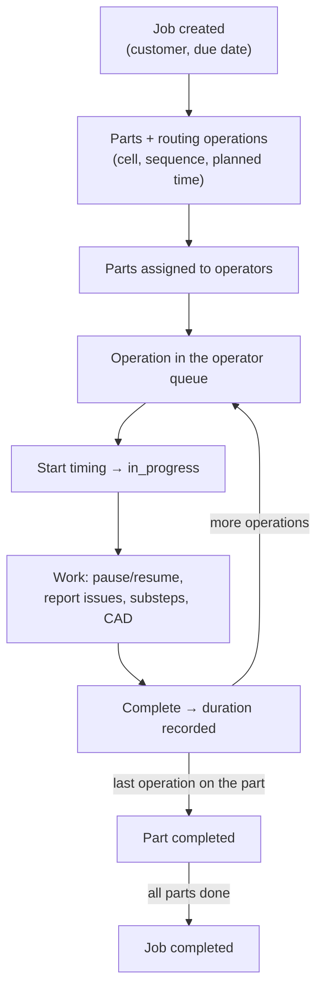

A job in Eryxon Flow is not a static record — it flows. This page is the map of that flow, from the office creating the work to the floor finishing it. Each stage links to the feature that owns it.

## The lifecycle

## Stages

1. **Job creation.** An admin enters a job — customer, due date — then its parts (with material, quantity, drawings, and assemblies via parent/child parts) and each part's operations. An operation carries the cell it runs at, a sequence, and a planned time. That routing is what the rest of the system reasons about.
2. **Assignment.** Parts are assigned to operators; the operations then appear in those operators' queues.
3. **Execution.** An operator opens an operation, starts timing (status → `in_progress`), and works — pausing and resuming, reporting issues, ticking off substeps, opening the drawing or 3D model. Completing stops the clock and records the actual duration.
4. **Completion rolls up.** When the last operation on a part completes, the part completes itself; when every part in a job completes, the job does too. No one closes it by hand.

## Time tracking

Every start/stop writes a time entry against the operator and the operation, and pauses are tracked separately, so booked hours always reflect who did the work and for how long — not the shared terminal. See [Time tracking on the operator terminal](/features/operator-terminal/).

## Where each stage lives

- **Flow control and WIP limits** keep cells from overloading — see [QRM & Flow Control](/features/qrm-flow/) and [Bullet & Yellow cards](/features/qrm-cards/).
- **The floor view** operators use — see [Operator Terminal](/features/operator-terminal/) and the [Operator manual](/guides/operator-manual/).
- **Batches and nests** that run as one unit — see [Batch & Nesting](/features/batch-management/).
- **Capacity and scheduling** across cells — see [Scheduling & Capacity](/features/scheduling/).
- **Quality issues and scrap** raised during work — see [Quality management](/guides/quality-management/).
- **Setting the shop up** in the first place — see the [Admin manual](/guides/admin-manual/).
