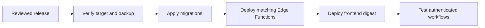

The default application is a responsive website. Phone, tablet, and desktop use the
same interface; installing it as a PWA is optional.

> **Licensing.** Self-hosting runs the free **Community** edition, source-available under the Business Source License 1.1. The source is on GitHub — read it, modify it, self-host it. Free production use covers a **single production site** (one facility or workshop) for your own internal operations, and the software is provided **AS IS**. Multi-site use, or offering the app as a service, needs a commercial licence — see [Editions & Pricing](/pricing/). Each released version converts to its Change License, GNU GPL v2.0 or later, four years after release.

## Before deploying

You need a Supabase backend with Auth, PostgreSQL, Storage, Realtime, and Edge
Functions, plus a host for the frontend. The frontend Docker image does not contain
the Supabase stack. For source builds, use Node 22 and repository access; the source
repository is private.

Use a reviewed release and its matching schema and functions. Maintainers should
follow [RELEASING.md](https://github.com/SheetMetalConnect/eryxon-flow/blob/main/RELEASING.md)
for required checks, release publication, production inputs, and rollback. Merging
to `main` does not deploy production.

Before applying migrations, back up the target database and storage, verify the
project reference, and run the tenant-reference audit described in the release
runbook. Apply migrations, then matching Edge Functions, then the frontend. Do not
reset a production database or repair migration history as a routine upgrade step.



## Frontend configuration

Copy `.env.example` to `.env` and configure the public frontend values:

```dotenv
VITE_SUPABASE_URL=https://yourproject.supabase.co
VITE_SUPABASE_PUBLISHABLE_KEY=your-public-key
VITE_SUPABASE_PROJECT_ID=yourproject
```

Keep database passwords, service-role keys, and integration credentials on the
backend. Values prefixed with `VITE_` are exposed to the browser. Configure required
Edge Function secrets, including `INTERNAL_SERVICE_SECRET`, on the verified backend
before deployment. Configure Auth redirect URLs for the frontend's actual address.

The container entrypoint generates `/env.js` from runtime `VITE_*` variables. This
lets the same image connect to different Supabase backends. PWA support is an
exception: it must be selected when the image is built.

## Deploy a released image

The repository includes `docker-compose.yml`, which reads `.env` and accepts an
`ERYXON_IMAGE` override. Choose the immutable GHCR digest recorded in the intended
GitHub release. The old `latest` tag is not updated by the release workflow.

For a first deployment, set `ERYXON_IMAGE` in `.env` to the released reference in
the form `ghcr.io/sheetmetalconnect/eryxon-flow@sha256:<digest>`, then run:

```sh
docker compose pull eryxon-flow
docker compose up -d --wait eryxon-flow
```

Configure registry access if the selected image requires authentication. Package
visibility is separate from repository visibility.

The container health check uses `http://127.0.0.1/health`. Once it is healthy, test
sign-in, operator switching, a production operation, issue reporting, and activity
against the intended backend. HTTP readiness alone does not verify those workflows.

For subsequent managed updates, use `scripts/deploy-image.sh` with the reviewed
Compose configuration and the released digest, following `RELEASING.md`. The script
records the selected image in `.release-image.env` and restores the previous image
if readiness fails. A frontend rollback does not reverse database migrations.

## Build a custom image

Build from the reviewed source revision. This creates a regular responsive web
image unless you explicitly enable PWA support:

```sh
docker build --tag eryxon-flow:custom .
```

To include PWA installation and service-worker support instead:

```sh
docker build --build-arg VITE_ENABLE_PWA=true --tag eryxon-flow:custom-pwa .
```

Other public build defaults, such as `VITE_SUPABASE_URL`, can also be passed with
`--build-arg`; runtime `.env` values supply the deployment's backend configuration.
Do not pass private backend credentials as frontend build arguments.

To use a local custom image, set `ERYXON_IMAGE` to its local tag and start the Compose
service without pulling it. Custom images are outside the managed release-digest
workflow; retain the previous verified image for recovery.

### Optional PWA verification

`VITE_ENABLE_PWA` defaults to `false` and is read at build time. Setting it at
container startup cannot enable PWA support in a regular web image. Rebuild when
changing this option.

An enabled build serves a manifest and registers `sw.js`. Test the browser's install
action over HTTPS or localhost. Its shortcuts open the shared operator interface;
old `/m` links remain supported. Cached assets allow the shell to render offline,
but manufacturing data and production actions require a backend connection. Updates
offer Reload or Later, with no forced reload during an active session.

A disabled build serves a retirement worker at the old `sw.js` URL. When the browser
checks for a worker update, it replaces the old caching worker and unregisters
itself. It does not reload open pages or delete caches. The next navigation reaches
the new web build; unrelated registrations remain intact.

## HTTPS and backend connectivity

For HTTPS, enable the optional Caddy service in `docker-compose.yml`, expose the app
internally on port 80, and configure `Caddyfile` for your hostname. Public hostnames
can use automatic certificates. LAN deployments can use `tls internal` if every
operator device trusts the local certificate authority.

Ensure the app's Content Security Policy allows the configured Supabase HTTP and
WebSocket origins. Keep the shipped Nginx security headers and review any additional
proxy policy. Test storage downloads, realtime updates, and the STEP viewer through
the actual proxy address.

The built-in STEP viewer parses files in the browser. Optional external CAD
processing must use the backend proxy and backend credentials; never put a CAD
service secret in a `VITE_` variable. See the
[Troubleshooting Guide](/guides/troubleshooting/) for connectivity and viewer issues.

## Backups and recovery

Back up PostgreSQL and storage objects together, retaining a copy outside the
application host. Verify recovery on a disposable target. The repository's
[backup and restore drill](https://github.com/SheetMetalConnect/eryxon-flow/blob/main/docs/BACKUP_RESTORE_DRILL.md)
describes the procedure and its prerequisites.

Keep the previous release digest and its schema compatibility notes. Plan database
recovery separately from frontend rollback, and verify authenticated workflows after
either operation.
