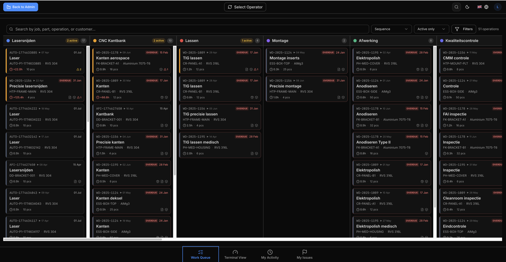
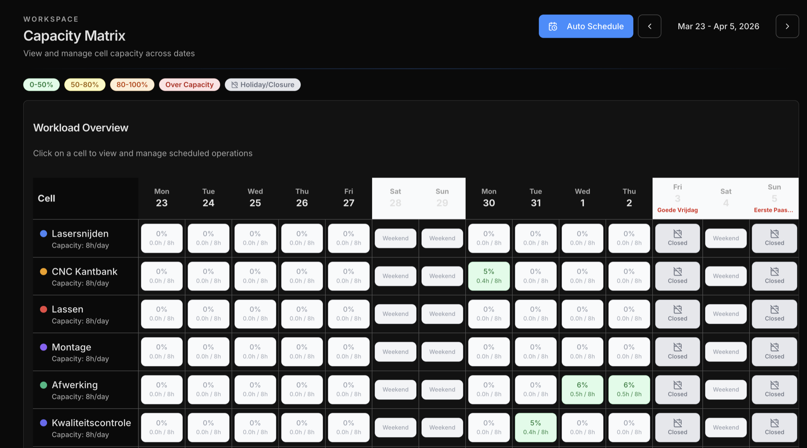

Eryxon Flow is a tablet-friendly manufacturing execution system for metalworking job shops — track jobs from your ERP to the shop floor without losing operator adoption.

## Choose your path

Pick the route that matches where you are in evaluating Eryxon Flow.

  <a href="https://app.eryxon.eu" data-cta-id="docs_intro_hosted_path_en" data-cta-surface="docs_intro_path_chooser" data-cta-kind="hosted_app" data-cta-locale="en" style="display:block;padding:var(--ery-space-5);border:1px solid var(--ery-border);border-radius:var(--ery-radius);background:var(--ery-surface-subtle);text-decoration:none;min-height:var(--ery-touch-min);">
    <strong style="display:block;color:var(--ery-text);margin-bottom:var(--ery-space-2);">Open the hosted trial</strong>
    Try the live app at app.eryxon.eu — no install. Best for a first look.
  </a>
  <a href="/managed-rollout/" data-cta-id="docs_intro_rollout_path_en" data-cta-surface="docs_intro_path_chooser" data-cta-kind="rollout_page" data-cta-locale="en" style="display:block;padding:var(--ery-space-5);border:1px solid var(--ery-border);border-radius:var(--ery-radius);background:var(--ery-surface-subtle);text-decoration:none;min-height:var(--ery-touch-min);">
    <strong style="display:block;color:var(--ery-text);margin-bottom:var(--ery-space-2);">Plan a managed rollout</strong>
    Get help with deployment, ERP integration, and rollout sequencing.
  </a>
  <a href="/guides/self-hosting/" data-cta-id="docs_intro_selfhost_path_en" data-cta-surface="docs_intro_path_chooser" data-cta-kind="self_host" data-cta-locale="en" style="display:block;padding:var(--ery-space-5);border:1px solid var(--ery-border);border-radius:var(--ery-radius);background:var(--ery-surface-subtle);text-decoration:none;min-height:var(--ery-touch-min);">
    <strong style="display:block;color:var(--ery-text);margin-bottom:var(--ery-space-2);">Evaluate it self-hosted</strong>
    Run it on your own infrastructure. Free and open source under Apache 2.0.
  </a>

## Is it right for your shop?

- **Operators** get a touch-friendly work queue: pull work by stage, log time, view STEP and PDF files, and report issues from the floor.
- **Admins** get real-time visibility: who is working on what, issue approvals, due-date overrides, and stage/material configuration.
- **Technical evaluators** get an API-first system: 24 REST endpoints, webhooks, MQTT, an MCP server, and pluggable planning adapters (FrePPLe, Odoo). It self-hosts on Supabase.

## What It Does

Eryxon tracks jobs, parts, and tasks through production with a mobile and tablet-first interface. Data comes from your ERP via API.

### For Operators
The interface shows what to work on, grouped by materials and manufacturing stages—organized the way your shop runs, not the way accountants think. 
- **Visual indicators** (colors, images) make tasks instantly recognizable. 
- **STEP file viewer** shows the geometry. 
- **PDF viewer** shows the drawings. 
- Start and stop time on tasks. 
- Report issues when something's wrong. 

Everything needed, nothing extra.

### For Admins
See who's working on what in real-time. 
- Assign specific work to specific people.
- Review and approve issues. 
- Override dates when needed. 
- Configure stages, materials, and templates. 

Real visibility into shopfloor activity without walking the floor.

### Work Organization
Work is displayed **kanban-style** with visual columns per stage. Operators see what's available and pull work when ready—not pushed by a schedule. Stages represent manufacturing zones (cutting, bending, welding, assembly).

**Quick Response Manufacturing (QRM)** principles are built in: 
- Visual indicators show when too many jobs or parts are in the same stage. 
- Limit work in progress per stage to maintain flow. 
- Track progress by stage completion, not just individual operation times. 
- Time tracking shows what's remaining, not just what's done.
- **Real-time updates**—changes appear immediately on all screens.

### Flexible Data
Jobs, parts, and tasks support **custom JSON metadata**—machine settings, bend sequences, welding parameters. Define reusable resources like molds, tooling, fixtures, or materials, then link them to work. Operators see what's required and any custom instructions in the task view.

---

## Users & Roles

### Operators
See their work queue, start/stop time tracking, mark tasks complete, view files, and report quality issues.

### Admins
Do everything operators can, plus: assign specific work to specific people, manage issues, override dates, and configure stages/materials/templates.

> **Note:** Operator accounts can be flagged as machines for autonomous processes.

---

## Real-Time Visibility

Track who's on-site and what they're working on in real-time. No guessing, no delays. Changes appear immediately across all screens via **WebSocket updates**.

---

## Integration-First Architecture

**100% API-driven.** Your ERP pushes jobs, parts, and tasks via 24 [REST API](/architecture/connectivity-rest-api) endpoints (Beta). Eryxon sends completion events back via [webhooks (Beta) or MQTT (Beta)](/architecture/connectivity-mqtt) — the MQTT client adds retry, circuit breaker, and dead-letter logging in v0.5. The [MCP server](/guides/mcp-setup) (Live) enables AI/automation integration with Claude Desktop and other AI tools, with stdio for local clients and Streamable HTTP for trusted self-hosted deployments.

### File handling
Request a signed upload URL from the API, upload STEP and PDF files directly to Supabase Storage, then reference the file path when creating jobs or parts. Large files (5-50MB typical) upload directly to storage—no timeouts, no API bottlenecks.

### Custom metadata
Include JSON payloads on jobs, parts, and tasks for your specific needs—tooling requirements, mold numbers, machine settings, material specifications, anything your shop needs to track.

### ERP & Planning Integrations
Partners like **Sheet Metal Connect e.U.** build integrations for common ERP systems. Or build your own using our GitHub starter kits with example code and documentation. v0.5 also ships pluggable **Beta** planning adapters for **FrePPLe** and **Odoo MRP** — see the [scheduling feature page](/features/scheduling/) for status details.

### Assembly Tracking
Parts can have parent-child relationships. Visual grouping shows assemblies with nested components. Non-blocking dependency warnings remind operators when child parts should be complete before starting assembly tasks—but they can override if needed.

### Issue Reporting
Operators create issues (NCRs) from active tasks with description, severity, and optional photos. Simple approval workflow: pending → approved/rejected → closed. Issues are informational—they don't block work from continuing.

---

## What We Don't Do (By Design)

*   **No financial tracking.** We track time spent on work, not costs, prices, or margins.
*   **No purchasing.** Tasks can be marked as external (subcontract work) and status tracked via API, but no PO management or vendor transactions.
*   **No BOM management.** We track what to produce, not item details or inventory. Parts can have parent-child links for assembly visualization, but not multi-level BOMs that do not live in production.
*   **Simple scheduling.** A built-in capacity-based scheduler can auto-allocate operations across cells, respecting factory calendar and working days. It's not an APS optimizer—dates can also come from your ERP, and admins can manually override due dates at any time.
*   **No reports.** Real-time stat panels only. No built-in historical analytics—but all data accessible via [REST API](/architecture/connectivity-rest-api) or [MCP server](/guides/mcp-setup) for your own reporting and AI-powered insights.

---

## Technical Stack

*   **Frontend:** React + TypeScript
*   **Backend:** Supabase (PostgreSQL, Edge Functions, Realtime, Storage)
*   **Auth:** JWT-based with role-based access control
*   **Files:** Supabase Storage with signed URLs
*   **STEP Viewer:** occt-import-js for client-side STEP parsing + Three.js rendering
*   **Integration:** [REST API](/architecture/connectivity-rest-api), [webhooks](/architecture/connectivity-mqtt), [MCP server](/guides/mcp-setup)
