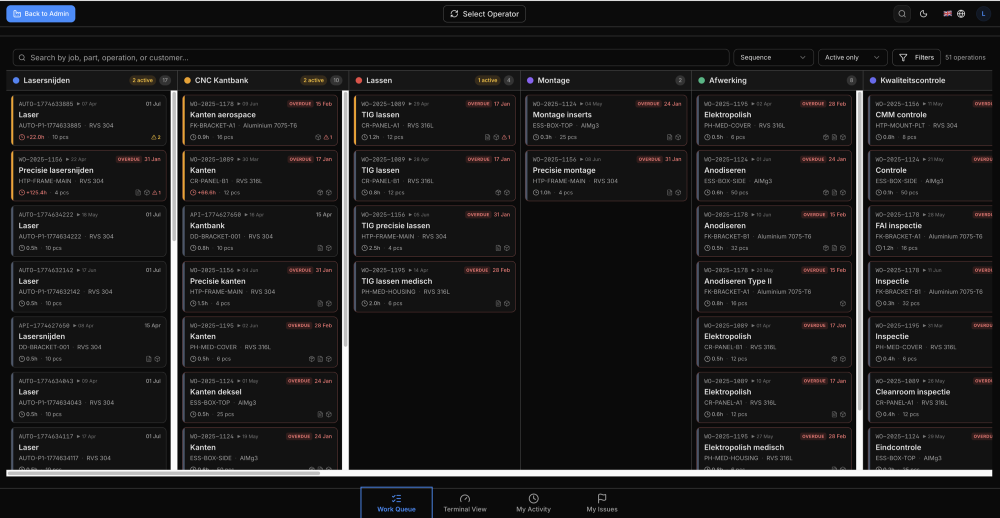
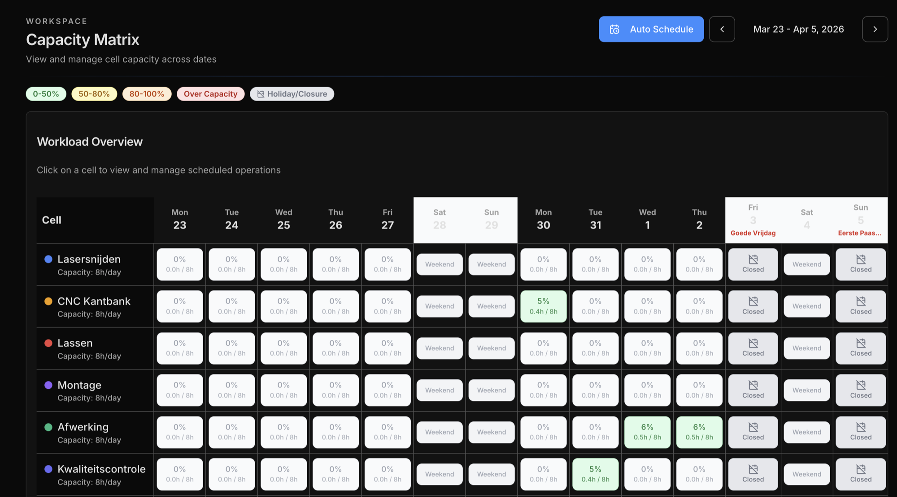

Eryxon Flow is a tablet-friendly manufacturing execution system for metalworking job shops — track jobs from your ERP to the shop floor without losing operator adoption.

## Choose your path

Pick the route that matches where you are in evaluating Eryxon Flow.

  <a href="https://app.eryxon.eu" data-cta-id="docs_intro_hosted_path_en" data-cta-surface="docs_intro_path_chooser" data-cta-kind="hosted_app" data-cta-locale="en" style="display:block;padding:var(--ery-space-5);border:1px solid var(--ery-border);border-radius:var(--ery-radius);background:var(--ery-surface-subtle);text-decoration:none;min-height:var(--ery-touch-min);">
    <strong style="display:block;color:var(--ery-text);margin-bottom:var(--ery-space-2);">Open the hosted trial</strong>
    Try the live app at app.eryxon.eu — no install. Best for a first look.
  </a>
  <a href="/managed-rollout/" data-cta-id="docs_intro_rollout_path_en" data-cta-surface="docs_intro_path_chooser" data-cta-kind="rollout_page" data-cta-locale="en" style="display:block;padding:var(--ery-space-5);border:1px solid var(--ery-border);border-radius:var(--ery-radius);background:var(--ery-surface-subtle);text-decoration:none;min-height:var(--ery-touch-min);">
    <strong style="display:block;color:var(--ery-text);margin-bottom:var(--ery-space-2);">Plan a managed rollout</strong>
    Get help with deployment, ERP integration, and rollout sequencing.
  </a>
  <a href="/guides/self-hosting/" data-cta-id="docs_intro_selfhost_path_en" data-cta-surface="docs_intro_path_chooser" data-cta-kind="self_host" data-cta-locale="en" style="display:block;padding:var(--ery-space-5);border:1px solid var(--ery-border);border-radius:var(--ery-radius);background:var(--ery-surface-subtle);text-decoration:none;min-height:var(--ery-touch-min);">
    <strong style="display:block;color:var(--ery-text);margin-bottom:var(--ery-space-2);">Evaluate it self-hosted</strong>
    The source is on GitHub — read it, modify it, self-host it. Free to self-host for a single workshop under the Business Source License 1.1.
  </a>

## Is it right for your shop?

- **Operators** get a touch-friendly work queue: pull work by cell, log time, view STEP and PDF files, and report issues from the floor.
- **Admins** get real-time visibility: who is working on what, issue approvals, due-date overrides, and cell/resource configuration.
- **Technical evaluators** get documented REST, webhook and MCP interfaces. Production lifecycle actions share database-enforced rules, MCP access is pinned to one workshop, and committed changes emit the same signed webhook events. It self-hosts on Supabase.

## What It Does

Eryxon tracks jobs, parts, and operations through production with a responsive operator interface. Data can come from your ERP through the API.

### For Operators
The interface shows what to work on, grouped by materials and production cells—organized the way your shop runs, not the way accountants think.
- **Visual indicators** (colors, images) make operations easy to recognize.
- **STEP file viewer** shows the geometry. 
- **PDF viewer** shows the drawings. 
- Start and stop time on operations.
- Report issues when something's wrong. 

Everything needed, nothing extra.

### For Admins
See who's working on what in real-time. 
- Assign specific work to specific people.
- Review and approve issues. 
- Override dates when needed. 
- Configure cells, resources, and templates.

Real visibility into shopfloor activity without walking the floor.

### Work Organization
Work is displayed **kanban-style** with visual columns per cell. Operators see what's available and pull work when ready—not pushed by a schedule. Cells represent manufacturing zones such as cutting, bending, welding, and assembly.

**Quick Response Manufacturing (QRM)** principles are built in: 
- Visual indicators show when too many jobs or parts are in the same cell.
- Limit work in progress per cell to maintain flow.
- Track progress through the routing, not just individual operation times.
- Time tracking shows what's remaining, not just what's done.
- **Real-time updates**—changes appear immediately on all screens.

### Flexible Data
Jobs, parts, and operations support **custom JSON metadata**—machine settings, bend sequences, welding parameters. Define reusable resources like molds, tooling, fixtures, or materials, then link them to work. Operators see what is required and any custom instructions in the operation view.

---

## Users & Roles

### Operators
See their work queue, start and stop time tracking, complete operations, view files, and report quality issues.

### Admins
Do everything operators can, plus: assign specific work to specific people, manage issues, override dates, and configure cells, resources, and templates.

> **Note:** Operator accounts can be flagged as machines for autonomous processes.

---

## Real-Time Visibility

Track who's on-site and what they're working on in real-time. No guessing, no delays. Changes appear immediately across all screens via **WebSocket updates**.

---

## Integration-First Architecture

Your ERP can create jobs, parts, and operations through the [REST API](/api/rest-api-reference/). Eryxon emits production changes through [signed webhooks](/architecture/connectivity-webhooks). The optional [MCP server](/guides/mcp-setup) exposes the same production rules to approved automation, over stdio or authenticated Streamable HTTP.

### File handling
Request a signed upload URL from the API, upload STEP and PDF files directly to Supabase Storage, then reference the file path when creating jobs or parts. Large files (5-50MB typical) upload directly to storage—no timeouts, no API bottlenecks.

### Custom metadata
Include JSON payloads on jobs, parts, and operations for your specific needs—tooling requirements, mold numbers, machine settings or material specifications.

### ERP & Planning Integrations
Partners like **Sheet Metal Connect e.U.** build integrations for common ERP systems, or build your own against the [REST API](/api/rest-api-reference/) and [payload reference](/api/payload-reference/). See [ERP Integration](/features/erp-integration/).

### Assembly Tracking
Parts can have parent-child relationships. Visual grouping shows assemblies with nested components. Non-blocking dependency warnings remind operators when child parts should be complete before starting assembly operations, but they can override if needed.

### Issue Reporting
Operators create issues (NCRs) from active operations with a description, severity and optional photos. The approval flow is pending → approved/rejected → closed. An issue blocks work only when it is marked as a standstill.

---

## What We Don't Do (By Design)

*   **No financial tracking.** We track time spent on work, not costs, prices, or margins.
*   **No purchasing.** Operations can represent subcontract work and be tracked through the API, but there is no PO management or vendor transaction flow.
*   **No BOM management.** We track what to produce, not item details or inventory. Parts can have parent-child links for assembly visualization, but not multi-level BOMs that do not live in production.
*   **Simple scheduling.** A built-in capacity-based scheduler can auto-allocate operations across cells, respecting factory calendar and working days. It's not an APS optimizer—dates can also come from your ERP, and admins can manually override due dates at any time.
*   **No reports.** Real-time stat panels only. No built-in historical analytics—but all data accessible via [REST API](/api/rest-api-reference/) or [MCP server](/guides/mcp-setup) for your own reporting and AI-powered insights.

---

## Technical Stack

*   **Frontend:** React + TypeScript
*   **Backend:** Supabase (PostgreSQL, Edge Functions, Realtime, Storage)
*   **Auth:** JWT-based with role-based access control
*   **Files:** Supabase Storage with signed URLs
*   **STEP Viewer:** occt-import-js for client-side STEP parsing + Three.js rendering
*   **Integration:** [REST API](/api/rest-api-reference/), [webhooks](/architecture/connectivity-webhooks), [MCP server](/guides/mcp-setup)
