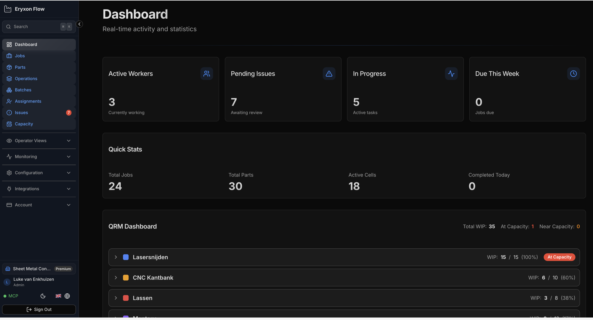

Eryxon Flow is een tabletvriendelijk manufacturing execution system voor metaalbewerkende job shops - volg orders van ERP tot werkvloer zonder operatoradoptie te verliezen.

## Kies uw route

Kies het pad dat past bij uw evaluatie van Eryxon Flow.

  <a href="https://app.eryxon.eu" data-cta-id="docs_intro_hosted_path_nl" data-cta-surface="docs_intro_path_chooser" data-cta-kind="hosted_app" data-cta-locale="nl" style="display:block;padding:var(--ery-space-5);border:1px solid var(--ery-border);border-radius:var(--ery-radius);background:var(--ery-surface-subtle);text-decoration:none;min-height:var(--ery-touch-min);">
    <strong style="display:block;color:var(--ery-text);margin-bottom:var(--ery-space-2);">Open de hosted trial</strong>
    Probeer de live app op app.eryxon.eu zonder installatie. Beste keuze voor een eerste verkenning.
  </a>
  <a href="/nl/managed-rollout/" data-cta-id="docs_intro_rollout_path_nl" data-cta-surface="docs_intro_path_chooser" data-cta-kind="rollout_page" data-cta-locale="nl" style="display:block;padding:var(--ery-space-5);border:1px solid var(--ery-border);border-radius:var(--ery-radius);background:var(--ery-surface-subtle);text-decoration:none;min-height:var(--ery-touch-min);">
    <strong style="display:block;color:var(--ery-text);margin-bottom:var(--ery-space-2);">Plan een managed rollout</strong>
    Krijg hulp bij deployment, ERP-integratie en rolloutvolgorde.
  </a>
  <a href="/nl/guides/self-hosting/" data-cta-id="docs_intro_selfhost_path_nl" data-cta-surface="docs_intro_path_chooser" data-cta-kind="self_host" data-cta-locale="nl" style="display:block;padding:var(--ery-space-5);border:1px solid var(--ery-border);border-radius:var(--ery-radius);background:var(--ery-surface-subtle);text-decoration:none;min-height:var(--ery-touch-min);">
    <strong style="display:block;color:var(--ery-text);margin-bottom:var(--ery-space-2);">Evalueer self-hosting</strong>
    Draai Eryxon op uw eigen infrastructuur. Source-available onder BSL 1.1.
  </a>

## Past het bij uw werkplaats?

- **Operators** krijgen een touchvriendelijke werkwachtrij: werk per stadium pullen, tijd loggen, STEP/PDF bekijken en issues op de werkvloer melden.
- **Admins** krijgen realtime zicht: wie waaraan werkt, issue-goedkeuringen, datum-overschrijvingen en configuratie van stadia/materialen.
- **Technische evaluatoren** krijgen een API-first systeem: 24 REST-endpoints, webhooks, MQTT, een MCP-server en planningadapters voor FrePPLe en Odoo.

> **Huidige status:** v0.5.1 is de huidige stabiele lijn. Web-app, REST API, webhooks, MQTT en de FrePPLe/Odoo-adapters zijn **Beta**; de **MCP-server is Live**. Native **Android**- en **iOS**-apps staan op de roadmap - vandaag is de browser-app het primaire oppervlak.

> **Status:** Het grootste deel van Eryxon Flow is in **Beta** — web-app, REST-API, webhooks, MQTT en de planning-adapters voor FrePPLe en Odoo. De **MCP-server is Live**. Native **Android**- en **iOS**-apps komen binnenkort.

> **Probeer het nu:** Open de <a href="https://app.eryxon.eu" data-cta-id="docs_intro_hosted_try_now_nl" data-cta-surface="docs_intro" data-cta-kind="hosted_app" data-cta-locale="nl">hosted versie op app.eryxon.eu</a> — geen installatie vereist.

## Wat Het Doet

Eryxon volgt orders, onderdelen en taken door de productie met een mobiele en tablet-vriendelijke interface. Gegevens komen via een API uit uw ERP.

### Voor Operators
De interface toont waaraan gewerkt moet worden, gegroepeerd op materialen en productiestadia—georganiseerd zoals uw werkplaats draait, niet zoals accountants denken. 
- **Visuele indicatoren** (kleuren, afbeeldingen) maken taken direct herkenbaar. 
- **STEP-file viewer** toont de geometrie. 
- **PDF-viewer** toont de tekeningen. 
- Start- en stoptijd op taken registreren. 
- Issues melden als er iets mis is. 

Alles wat nodig is, niets extra's.

### Voor Admins
Zie in realtime wie waaraan werkt. 
- Drag-and-drop om specifiek werk aan specifieke mensen toe te wijzen. 
- Issues beoordelen en goedkeuren. 
- Datums overschrijven indien nodig. 
- Stadia, materialen en sjablonen configureren. 

Echt inzicht in de activiteiten op de werkvloer zonder de vloer op te hoeven gaan.

### Werkorganisatie
Werk wordt **kanban-stijl** weergegeven met visuele kolommen per stadium. Operators zien wat beschikbaar is en "pullen" werk wanneer ze klaar zijn—niet "gepushed" door een planning. Stadia vertegenwoordigen productie-zones (snijden, buigen, lassen, assemblage).

**Quick Response Manufacturing (QRM)** principes zijn ingebouwd: 
- Visuele indicatoren tonen wanneer te veel orders of onderdelen in hetzelfde stadium zijn. 
- Beperk onderhanden werk (WIP) per stadium om de doorloop te behouden. 
- Volg de voortgang per stadium-voltooiing, niet alleen individuele bewerkingstijden. 
- Handmatige tijdregistratie toont wat er nog rest, niet alleen wat er gedaan is. 
- **Real-time updates**—wijzigingen verschijnen onmiddellijk op alle schermen.

### Flexibele Data
Orders, onderdelen en taken ondersteunen **aangepaste JSON-metadata**—machine-instellingen, buigsequenties, lasparameters. Definieer herbruikbare middelen zoals mallen, gereedschappen, opspanningen of materialen en koppel ze aan het werk. Operators zien wat er nodig is en eventuele aangepaste instructies in de taakweergave.

---

## Gebruikers & Rollen

### Operators
Zien hun werkwachtrij, registreren start/stop tijden, markeren taken als voltooid, bekijken bestanden en melden kwaliteitsproblemen.

### Admins
Kunnen alles wat operators kunnen, plus: specifiek werk toewijzen aan specifieke mensen, issues beheren, datums overschrijven en stadia/materialen/sjablonen configureren. Dagelijkse drag-and-drop toewijzing zet het juiste werk bij de juiste mensen. Omdat mensen ertoe doen.

> **Let op:** Operator-accounts kunnen worden gemarkeerd als machines voor autonome processen.

---

## Real-Time Inzicht

Volg in realtime wie er aanwezig is en waaraan zij werken. Geen gegis, geen vertragingen. Wijzigingen verschijnen onmiddellijk op alle schermen via **WebSocket-updates**.

---

## Integratie-Eerste Architectuur

**100% API-gedreven.** Uw ERP stuurt orders, onderdelen en taken via 24 REST-API-endpoints (Beta). Eryxon stuurt voltooiingsgebeurtenissen terug via webhooks (Beta) of MQTT (Beta) — de MQTT-client krijgt in v0.5 retry, circuit breaker en dead-letter logging. De MCP-server (Live) maakt AI/automatisering-integratie mogelijk met stdio voor lokale clients en Streamable HTTP voor vertrouwde zelfgehoste deployments.

### Bestandsafhandeling
Vraag een ondertekende upload-URL aan via de API, upload STEP- en PDF-bestanden rechtstreeks naar Supabase Storage en verwijs vervolgens naar het bestandspad bij het maken van orders of onderdelen. Grote bestanden (typisch 5-50MB) worden rechtstreeks naar de storage geüpload—geen timeouts, geen API-knelpunten.

### Aangepaste metadata
Voeg JSON-payloads toe aan orders, onderdelen en taken voor uw specifieke behoeften—gereedschapsvereisten, malnummers, machine-instellingen, materiaalspecificaties, alles wat uw werkplaats moet bijhouden.

### ERP- & Planning-Integraties
Partners zoals **Sheet Metal Connect e.U.** bouwen integraties voor gangbare ERP-systemen. Of bouw uw eigen integratie met onze GitHub starter kits met voorbeeldcode en documentatie. v0.5 levert ook pluggable planning-adapters in **Beta**-status voor **FrePPLe** en **Odoo MRP**.

### Assemblage Volgen
Onderdelen kunnen ouder-kind relaties hebben. Visuele groepering toont assemblages met geneste componenten. Niet-blokkerende afhankelijkheidswaarschuwingen herinneren operators eraan wanneer onderdelen voltooid moeten zijn voordat assemblage-taken worden gestart—maar ze kunnen dit overschrijven indien nodig.

### Issue Rapportage
Operators maken issues (NCR's) aan vanuit actieve taken met een beschrijving, ernst en optionele foto's. Eenvoudige goedkeuringsworkflow: in behandeling → goedgekeurd/afgewezen → gesloten. Issues zijn informatief—ze blokkeren de voortgang van het werk niet.

---

## Wat We Niet Doen (Bewust)

*   **Geen financiële tracking.** We volgen de tijd besteed aan werk, niet de kosten, prijzen of marges.
*   **Geen inkoop.** Taken kunnen als extern worden gemarkeerd (uitbesteed werk) en de status kan via de API worden gevolgd, maar er is geen inkoopbeheer of leveranciers-transacties.
*   **Geen BOM-beheer.** We volgen wat er geproduceerd moet worden, niet de itemdetails of voorraad. Onderdelen kunnen ouder-kind links hebben voor assemblage-visualisatie, maar geen multi-level BOM's die niet in de productie leven.
*   **Geen planning.** Datums komen meestal uit uw ERP, maar admins kunnen deze handmatig overschrijven. We berekenen of optimaliseren geen planningen—u houdt de controle.
*   **Geen rapportages.** Alleen real-time statistiekenpanelen. Geen ingebouwde historische analyses—maar alle data is toegankelijk via API/MCP voor uw eigen rapportages.

---

## Technische Stack

*   **Frontend:** React + TypeScript
*   **Backend:** Supabase (PostgreSQL, Edge Functions, Realtime, Storage)
*   **Auth:** Op JWT gebaseerd met rolgebaseerde toegangscontrole
*   **Bestanden:** Supabase Storage met ondertekende URL's
*   **STEP Viewer:** occt-import-js voor client-side STEP parsing + Three.js rendering
*   **Integratie:** REST API, webhooks, MCP-server
